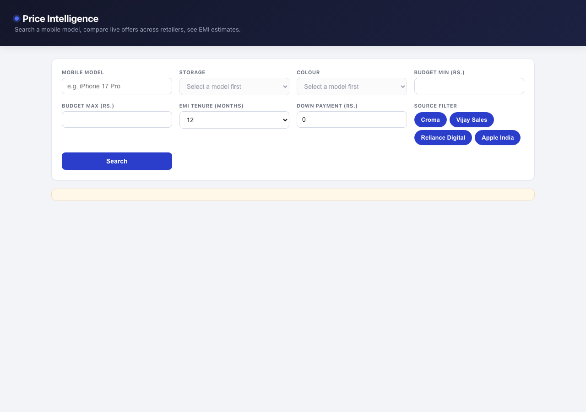
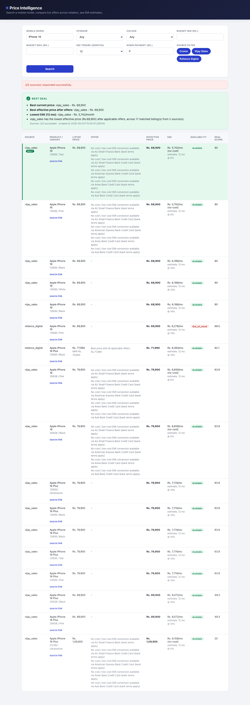
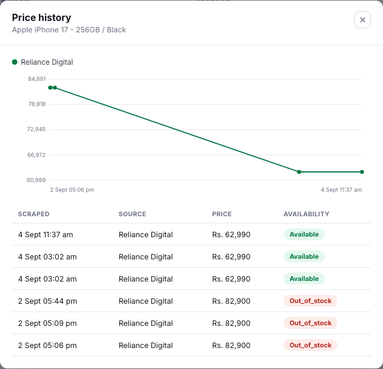

# E-commerce Price Intelligence Platform

A Flask application that takes a mobile-phone query, scrapes multiple Indian
retail sources, matches the same product/variant across them, extracts price
and offer data, computes EMI scenarios, and returns a ranked "best deal"
comparison — built to the spec in `Ecommerce_Price_Intelligence_Technical_Test.pdf`.

## What does this project actually do? (explained with zero jargon)

Say you want to buy a phone. Normally you'd open Croma, then Vijay Sales,
then Reliance Digital, search the same phone on each one, write down the
price from each, and do the math on EMI yourself. That's slow and annoying.

This project is a small robot that does that whole chore for you in a few
seconds:

1. **You type a phone name** into one search box (e.g. "iPhone 16").
2. The robot **visits several shopping sites at once** (like sending three
   friends to three different shops at the same time) and reads off each
   one's price, discount, and stock status.
3. Every shop writes the same phone's name slightly differently — one says
   `"Apple iPhone 16 (128GB) - Black"`, another says
   `"iPhone 16 128GB Black"`. The robot **works out these are the same
   phone** and groups them together instead of showing them as unrelated
   products.
4. It calculates **EMI** (the monthly installment amount if you buy on a
   loan) using the same maths a bank would use.
5. It **sorts everything by price** and tells you, in plain language, which
   shop has the best deal and why.
6. You see one clean table: phone, price at each shop, EMI, and a
   "best deal" pick — instead of five browser tabs.

Three things make this genuinely hard to get right, and this project deals
with all three explicitly (details further down):
- Shopping sites change their page layout, and some (Croma) actively try to
  block robots — the app has to keep working even when one source fails.
- The same phone is *written* differently on every site — the app has to be
  smart enough to recognize it's still the same phone.
- A phone search shouldn't accidentally show you a smartwatch or a pair of
  earbuds just because the site's own search engine is a bit loose — the
  app filters those out.

Everything below this point is the technical documentation — how it's built,
why each decision was made, and how to run it.

## Contents

- [Quick start](#quick-start)
- [Architecture](#architecture)
- [Source adapters — what's real, what's not, and why](#source-adapters--whats-real-whats-not-and-why)
- [Data model](#data-model)
- [Product matching](#product-matching)
- [EMI and offer logic](#emi-and-offer-logic)
- [API](#api)
- [Full-catalogue crawl (scheduled refresh)](#full-catalogue-crawl-scheduled-refresh)
- [Testing](#testing)
- [Assumptions and known limitations](#assumptions-and-known-limitations)

## Quick start

### Local development (SQLite, zero setup)

```bash
python3 -m venv .venv && source .venv/bin/activate
pip install -r requirements.txt
cp .env.example .env
python run.py          # http://localhost:5000, SQLite tables auto-created
```

Optional: seed a small offline demo dataset (no network calls) so
`/api/product`, `/api/offers` and `/api/price-history` have something to show
before you run your first live search:

```bash
python scripts/seed_db.py
```

### Local development (Docker Compose, Postgres)

Runs the app against Postgres — the spec's preferred database — instead of
SQLite, with no local Python/Postgres install needed:

```bash
docker compose up --build
# http://localhost:8000, migrations run automatically before the app starts
```

`docker-compose.yml` brings up two services: `db` (Postgres 16, with a
healthcheck `web` waits on) and `web` (built from the same `Dockerfile` used
in production, `DATABASE_URL` pointed at the `db` service). `docker-entrypoint.sh`
runs `flask db upgrade` before `gunicorn` starts, so the schema is always
current. Data persists in a named volume (`postgres_data`) across restarts;
`docker compose down -v` clears it for a clean slate.

For production, this deploys to Render (Postgres, `Dockerfile`-based) — see
[Deploying to Render](#deploying-to-render) below.

### Run the tests

```bash
pip install -r requirements-dev.txt
pytest -v
```

All 76 tests run fully offline (mocked HTTP via `responses`, in-memory
SQLite) — no network access or live retailer availability required. Several
of them replay **real HTML/JSON captured live from the target sites while
building this** (see `tests/fixtures/`), not synthetic markup.

### Try a real search

```bash
curl -X POST https://webscrping-model-corient-c1ww.onrender.com/api/search \
  -H "Content-Type: application/json" \
  -d '{"model": "Redmi Note 15 Pro", "emi_tenure_months": 12, "down_payment": 5000}'
```

This one's picked deliberately: on the live deploy, it reliably comes back
with 15+ matched variants, a full price/EMI ranking, and a recommendation —
a better first impression than a query that only clears one source. `iPhone
17 Pro` works the same way locally, and still makes a fine example there —
see [Deploying to Render](#deploying-to-render) further down for why
Apple-model queries specifically are hit-or-miss from the live instance.

Response shape (real output, `results` trimmed from 17 down to one entry —
`emi`, `offers` and `recommendation` are the fields worth looking at):

```jsonc
{
  "crawl_id": "c006768c844e42d9af2833376ab36329",
  "page": 1,
  "query": { "model": "Redmi Note 15 Pro", "storage": null, "colour": null, "budget_min": null, "budget_max": null },
  "emi_assumptions": {
    "tenure_months": 12, "down_payment": 5000.0, "annual_rate_percent": 14.0,
    "note": "EMI figures are calculated estimates, not scraped facts."
  },
  "sources_attempted": 3, "sources_succeeded": 1, "sources_failed": 2,
  "results": [
    {
      "listing_id": 45, "variant_id": 21, "source": "vijay_sales",
      "product": { "brand": "Xiaomi", "model": "Redmi Note 15 Pro" },
      "variant": { "storage": "128GB", "colour": "Carbon Black" },
      "product_name": "Redmi Note 15 Pro 5G (8GB RAM, 128GB Storage) ... (Carbon Black) P251813",
      "product_url": "https://www.vijaysales.com/p/P251813/redmi-note-15-pro-...",
      "mrp": 31999.0, "selling_price": 31999.0, "effective_price": 31999.0,
      "availability": "available", "deal_score": 80.0,
      "offers": [],
      "emi": {
        "tenure_months": 12, "annual_rate_percent": 14.0, "monthly_emi": 2424.16,
        "total_repayment": 29089.95, "total_interest": 2090.95,
        "is_no_cost_emi": false, "estimate": true
      },
      "scraped_at": "2026-09-04T11:43:56.968690"
    }
    // ...16 more, sorted by effective_price ascending
  ],
  "recommendation": {
    "best_current_price": { "source": "vijay_sales", "amount": 31999.0 },
    "best_effective_price": { "source": "vijay_sales", "amount": 31999.0 },
    "lowest_emi": { "source": "vijay_sales", "monthly_emi": 2424.16, "tenure_months": 12 },
    "reason": "Vijay Sales has the lowest effective price (Rs.31,999) after applicable offers, across 17 matched listing(s) from 1 source(s)."
  }
}
```

Or generate the committed sample output yourself:

```bash
python scripts/export_sample_output.py "iPhone 17 Pro" --storage 256GB
# writes sample_output/comparison_iphone_17_pro.json and .csv
```

`sample_output/` also has a second, broader example (`comparison_iphone_16.*`,
genuinely returning results from both Vijay Sales and Reliance Digital at
once), captured from a real run against live sources:




## Deploying to Render

The repo includes `render.yaml` (a Render [Blueprint](https://render.com/docs/blueprints)),
so the whole stack — the web service plus a managed Postgres — can be
created in one step:

1. Push this repo to GitHub (`origin` is already configured).
2. In the Render dashboard: **New +** → **Blueprint** → pick this repo. Render
   reads `render.yaml`, provisions a free Postgres database named
   `price-intel-db`, and a Docker web service named `price-intel-web` wired
   to it via `DATABASE_URL` automatically.
3. Click **Apply**. First deploy takes a few minutes (Docker build + `flask
   db upgrade` running the Alembic migrations against the fresh database).
4. Once live, `https://<your-service>.onrender.com/health` should return
   `{"status": "ok", "db": "ok"}`.

This repo's own deploy is live at
[https://webscrping-model-corient-c1ww.onrender.com/](https://webscrping-model-corient-c1ww.onrender.com/)
(health check: [https://webscrping-model-corient-c1ww.onrender.com/health](https://webscrping-model-corient-c1ww.onrender.com/health)).
Free tier - the first request after a period of inactivity can take 30-50s
while the instance spins back up.

Everything else about the deployed instance behaves normally. One thing to
note: Reliance Digital may not return results there, because the free
tier's hosting region is Singapore and Reliance Digital's bot-protection
appears to treat that IP range more strictly than an Indian residential
one. Running the app locally does not hit this - Reliance Digital works
normally there.

A second, narrower one: on the deployed instance, Vijay Sales returns
results normally for every brand except Apple/iPhone. Vijay Sales' own
catalogue clearly has iPhone stock (confirmed directly against their API),
so this isn't missing inventory - it looks like Apple-specific
anti-scraping protection (common industry-wide, tied to MAP-style reseller
agreements) that other brands aren't subject to. Locally, iPhone searches
on Vijay Sales work fine.

What makes this work, specifically:
- `docker-entrypoint.sh` runs `flask db upgrade` before starting `gunicorn`,
  and binds to `$PORT` (Render assigns this dynamically — a hardcoded port
  won't get traffic routed to it).
- `app/config.py` rewrites a `postgres://` URL to `postgresql://` — Render
  (like Heroku) hands out the former, but SQLAlchemy 1.4+/2.0 only
  recognizes the latter and fails on first request otherwise.
- `render.yaml`'s `healthCheckPath: /health` is what Render polls to decide
  the deploy is actually up.

No Blueprint access, or prefer doing it by hand instead: create a Postgres
instance and a Docker-runtime web service pointing at this repo's
`Dockerfile` in the dashboard, then set `DATABASE_URL` on the web service to
the Postgres instance's **Internal Connection String** and `SECRET_KEY` to
any random value — everything else has a sensible default (see
`.env.example`).

## Architecture

```
app/
  scrapers/     BaseAdapter contract + one adapter per retailer + a registry
  matching/     raw title -> canonical brand/model/storage/colour, and
                grouping listings into Product/Variant rows
  pricing/      EMI math and deal-score, kept separate from scraped facts
  services/     search_service.py orchestrates: cache check -> dispatch
                adapters concurrently -> persist -> match -> price/EMI ->
                rank; cache.py is the short-TTL DB-backed search cache
  routes/       views.py (UI, /health), api.py (/api/*)
  models.py     Product, Variant, Listing (append-only), Offer, CrawlRun,
                SearchCache
```

Adding a retailer = one new file in `app/scrapers/` implementing
`BaseAdapter.search()`, plus one line in `app/scrapers/registry.py`. Nothing
else changes — `search_service.py` only ever talks to the registry.

**Reliability, by construction:**
- `BaseAdapter.run()` catches every exception a `search()` implementation can
  raise and converts it to `AdapterResult(ok=False, error=...)` — a source
  failing never takes down `/api/search`; the response always carries
  whichever sources did succeed, plus `source_notes` explaining what failed
  and why.
- HTTP fetches go through a shared `requests.Session` with `urllib3.Retry`
  (backoff on `429`/`5xx` only — **not** `403`, see below), per-domain
  minimum-interval rate limiting, and a configurable timeout.
- `app/utils/robots.py` checks `robots.txt` (via `urllib.robotparser`) before
  every fetch; if it can't be read, access is denied by default rather than
  assumed open.
- Adapters run concurrently via a bounded `ThreadPoolExecutor`
  (`SCRAPE_MAX_WORKERS`, default 3).
- A DB-backed cache (`SEARCH_CACHE_TTL_SECONDS`, default 900s) means an
  identical repeated search reuses the last crawl instead of re-scraping.
- Every scraped row keeps its source, `crawl_id` and `scraped_at`; `Listing`
  is append-only, so price history is just a query over past rows for a
  variant — no separate history table or background job needed to have it.
- **Concurrent searches on SQLite are handled deliberately, not accidentally.**
  The dev server runs threaded (the UI fires an instant catalog lookup
  alongside a live search), and the first version of `_run_crawl` opened a
  DB write transaction *before* dispatching the scrape and only committed
  after it finished — so on SQLite, two overlapping searches reliably hit
  `database is locked`, confirmed with real concurrent requests during
  development. Fixed at the source: `crawl_id` is generated in Python up
  front, all DB writes (the `CrawlRun` row, every `Listing`/`Offer`) happen
  in one short transaction *after* scraping completes, and SQLite runs in
  WAL mode with a `busy_timeout` as defense-in-depth for whatever brief
  overlap remains. Postgres was never affected — real MVCC handles this
  natively.
- Structured JSON logs (`app/utils/logging.py`) carry `crawl_id`, `source`,
  `url`, `status_code` on every fetch. `LOG_FILE` (see `.env.example`, set
  to `process.log` for local dev) sends them to a rotating file instead of
  the terminal — a single `/api/search` logs one line per HTTP fetch across
  3 adapters, noisy mid-conversation in a terminal. Left unset in
  Docker/Render (`render.yaml` doesn't set it), which need stdout instead:
  Render's log viewer reads container stdout, and a file inside that
  ephemeral container would vanish on redeploy.

## Source adapters — what's real, what's not, and why

Before writing selectors, I made a handful of **live, `robots.txt`-respecting,
single-shot research requests** against the three sources the spec
recommends (Croma, Vijay Sales, Reliance Digital), to ground the adapters in
what those pages actually do rather than guessing. That produced three quite
different, and quite real, engineering situations:

### Croma — blocked by bot-management infrastructure, not by robots.txt

Direct requests to `croma.com` — the homepage, `/robots.txt` itself, and the
target iPhone listing page — all returned **HTTP 403 "Access Denied"** from
Akamai's edge WAF (see `tests/fixtures/croma_403.html`, the real captured
response body). That's an access-control decision by bot-management
infrastructure, not a `robots.txt` rule. The spec is explicit: *"Respect
robots.txt, site terms, rate limits, and access controls. Do not bypass
CAPTCHA or authentication barriers."* — so `app/scrapers/croma.py` does not
attempt stealth headers, proxy rotation, or any other evasion to get around
it. It's fully implemented with real request flow and defensively-written
(best-effort, unverified) selectors, and it fails the way this whole system
is designed to handle a source failing: cleanly, via `SourceBlockedError`,
leaving the other two adapters' results intact. This is exercised directly in
`tests/adapters/test_croma_adapter.py` by replaying the real 403 response.

### Vijay Sales — the listing page doesn't have live prices, but its own API does

`vijaysales.com/c/iphones` allows a normal fetch, but its price blocks turned
out to be either hidden or wrapped in Adobe Experience Manager
`<sly data-sly-test>` template comments that never reach the rendered HTML —
so scraping that page directly is unreliable for price. The page's own
`store-config` meta tag advertises a public GraphQL endpoint
(`/api/graphql`, `GET`), and calling it directly —
`products(search: "iphone 17 pro") { name sku stock_status rating_summary
price_range { ... } }` — returns clean, authoritative data: the exact API
the site's own frontend uses, no auth, no bypass. `app/scrapers/vijay_sales.py`
therefore skips HTML scraping for this source entirely and calls that API,
which is also a strict improvement over the spec's given category URL: it's
a full-text product search, so it isn't limited to the iPhone-only listing
page and works for any brand/model. This is the spec's own optional bullet,
*"Direct API/network-data extraction where appropriate and permitted."*
Because it's a full-text search, a query can also match things that aren't
phones at all — a smartwatch, earbuds, a "Smartphone Printer" — that a
name-keyword blocklist alone can't fully anticipate; this was caught during
live testing with a brand-only query. The GraphQL query also asks for each
item's own site category (`categories { url_key }`), and `search()` keeps
only items tagged `"smartphones"` there — an authoritative signal from the
site itself, not a name guess.
Bank-offer text isn't in that API's schema, and the spec's given bank-offers
URL 404s today (the site moved that content into an on-page popup component
since the spec was written) — so as a bounded, best-effort enrichment, the
adapter fetches the product page for up to 5 top matches and pulls bank
names + EMI terms out of an embedded `data-cf` JSON fragment; if that fails,
the (already fully priced) listing ships anyway.

### Reliance Digital — recommended page as a base, plus a smarter cascade on top

`reliancedigital.in/collection/smartphones` (the spec's given URL) is fully
server-rendered (Vue/Nuxt) with real product cards — name, live price, MRP,
discount, image, stock status, and a per-card bank/card offer teaser —
already present in the raw HTML, so `app/scrapers/reliance_digital.py`
scrapes it directly with `BeautifulSoup`. One robots.txt constraint shapes
every request this adapter makes: Reliance Digital's `robots.txt` disallows
**every URL containing a query string** (`Disallow: /*?*`, plus an explicit
`Disallow: /products?q=*`), including its own site-search endpoint and the
`?internal_source=...` tracking suffix every product link carries — so this
adapter never appends query parameters, and always strips that suffix off
product URLs before following them.

That single generic page has a real gap, though: it only ever shows the
~50 products (across *every* brand) that happen to be first server-rendered
right now, with no robots-compliant way to page through the rest. Verified
during development: searching "iPhone 17 Pro" against it alone returned
**zero** Reliance Digital results, despite the phone being in stock on the
site. Reliance Digital's own public sitemap
(`sitemap.xml` → `sitemap/collections.sitemap.xml`) lists thousands of
static, robots-compliant `/collection/<slug>` pages, and several are genuine
complete per-model catalogues — `/collection/iphone-17-pro` alone lists
every storage/colour combination of both iPhone 17 Pro *and* Pro Max. So
the adapter now tries, in order: the most specific known collection for the
query (`MODEL_COLLECTION_SLUGS`) → a broader Apple-only collection → the
original generic page — stopping at the first tier that actually returns
matching listings. Verified live, this took the same "iPhone 17 Pro" search
from 0 Reliance Digital results to 12.

These per-model slugs are Reliance Digital's own marketing/campaign URLs
though, not a documented stable API — several looked plausible but already
404'd or redirected to an empty page when checked while building this (their
campaign pages appear to rotate over time). So the cascade treats a stale
slug as "skip to the next tier," never as a fetch failure — worst case, a
fully stale curated list degrades exactly back to the original single-page
behavior, it never does worse.

### No Playwright / headless browser

Not used anywhere, and this is a deliberate call against one of the spec's
*optional* bullets: it isn't needed for any of the three sources above (the
GraphQL call solves Vijay Sales, Reliance Digital is server-rendered
already), and for Croma the blocker is a WAF decision, not a
JavaScript-rendering problem — a headless browser wouldn't legitimately get
past it without fingerprint evasion, which is exactly the kind of access-
control bypass the spec says not to do.

## Data model

- **Product** — `brand`, `model`, `canonical_name`
- **Variant** — `storage`, `colour`, `variant_key` (the normalized
  `brand|model|storage|colour` string used to group the same item across
  sources)
- **Listing** — one scraped snapshot: `source`, prices, `availability`,
  `seller`, `rating`, `crawl_id`, `scraped_at`. **Append-only** — a new row
  is written every crawl rather than updating one in place, which is what
  makes price history free.
- **Offer** — raw scraped offer *facts* only: `offer_text`, `offer_type`,
  `bank`, `offer_discount`, `emi_available`/`emi_tenure`/`emi_rate` (when the
  source states them). Never mixed with calculated values.
- **CrawlRun** — one row per search: which sources were attempted, how many
  succeeded/failed, and human-readable notes.
- **SearchCache** — maps a normalized query to the `crawl_id` that answered
  it, with a TTL.

## Product matching

`app/matching/normalizer.py` turns a raw, source-specific title into
brand/model/storage/colour. It's built around the shapes real listing titles
actually take (verified against live Vijay Sales/Reliance Digital output):
brand+model first, then a comma/parenthesis-delimited spec list ending in
colour — e.g. `"Apple iPhone 17 Pro (256GB Storage, Black)"` or
`"OPPO Reno16c 256 GB, 8 GB RAM, Stellar Purple, Mobile Phone"` — or, for
some Vijay Sales listings (Nothing Phone in particular), a **pipe**-delimited
spec tail instead of commas, with the model number itself sitting in a
parenthetical right after the brand: `"Nothing Phone (4a) Pro 5G (8GB RAM,
128GB Storage) | Qualcomm Snapdragon 7 Gen 4 | 5400mAh Battery | Glyph
Interface | Silver"`. This second shape was caught live (it was silently
producing an empty `model` and dumping the entire spec tail into `colour`)
and is covered by regression tests
(`test_pipe_delimited_title_with_model_number_in_leading_parens` and
neighbours in `tests/unit/test_normalizer.py`). Storage and RAM segments are
recognized and discarded, filler segments (`"Mobile Phone"`, `"5G"`, ...)
are discarded, and the last surviving segment is taken as colour — rather
than guessing colour out of unstructured free text, which is far less
reliable given how varied marketing colour names are ("Cosmic Orange",
"Ultramarine", "Stellar Purple", ...).

`app/matching/matcher.py` groups listings into `Variant` rows: an exact
`variant_key` match first; if that misses (e.g. one source's model text has
an extra/missing word), a `rapidfuzz` fuzzy fallback compares model text
among variants that **already share the same brand, storage, and colour** —
storage/colour are exact-match filters, not part of the fuzzy comparison,
specifically so that two genuinely different colours or capacities of the
same phone are never merged just because their model text matches (this was
caught and fixed during live testing — see
`test_different_colour_creates_separate_variant_not_fuzzy_merged`).

The boundary-splitting step that turns a genuinely concatenated title like
`"iphone17pro"` into `"iphone 17 pro"` was, at first, also firing inside
already-correct short model codes that plenty of Android brands write with
no space of their own — Samsung's `"S24"`, `"A56"`, `"M14"` and so on —
turning `"Galaxy A56"` into `"Galaxy A 56"` and splitting what should have
been one variant into two differently-spelled ones. It now only splits a
token whose leading letters run to 3+ characters (a real word, not a 1-2
letter series prefix) — see
`test_short_model_code_prefix_is_not_split_from_its_digits`.

## EMI and offer logic

`app/pricing/emi.py` keeps scraped facts and calculated values strictly
separate, per the spec:

- **Effective price** = `selling_price - best single offer_discount`. Offers
  are **not** assumed combinable — the largest single discount is used, not
  a sum of every offer on the listing.
- **EMI** uses the standard reducing-balance formula
  `EMI = P·r·(1+r)^n / ((1+r)^n - 1)` on the financed amount (effective price
  minus down payment), or a flat `P/n` split with zero interest when a
  no-cost-EMI offer is present or the caller passes a `0%` rate — a clearly
  documented assumption, not a guess.
- Every EMI figure in the API response carries `"estimate": true`, and the
  UI labels EMI values as estimates.
- `app/pricing/deal_score.py` is a documented, bounded 0–100 score
  (60% effective-price rank within the matched group, 20% discount depth,
  20% availability, scaled by a small source-reliability weight) — a
  reasonable tie-breaker beyond raw price, not a black box.

## API

Matches the spec's endpoint table exactly:

| Endpoint | Purpose |
|---|---|
| `GET /` | Search UI |
| `GET /health` | `{"status": "ok", "db": "ok"}` |
| `POST /api/search` | `{model, storage?, colour?, budget_min?, budget_max?, emi_tenure_months?, down_payment?, emi_annual_rate_percent?, sources?}` → ranked comparison |
| `GET /api/product/<variant_id>` | Normalized product/variant + latest listing per source |
| `GET /api/offers/<listing_id>` | Offers/EMI-relevant facts for one listing |
| `GET /api/price-history/<variant_id>` | All scraped price points for a variant, oldest to newest, plus detected price drops |

### Trying the ID-based endpoints

`variant_id`/`listing_id` are assigned at scrape time, so there's nothing
fixed to hardcode here - run a search, then pull them out of that response:

```bash
BASE_URL=https://webscrping-model-corient-c1ww.onrender.com

curl -s -X POST $BASE_URL/api/search \
  -H "Content-Type: application/json" \
  -d '{"model": "Redmi Note 15 Pro"}' > /tmp/search.json

VARIANT_ID=$(python3 -c "import json; print(json.load(open('/tmp/search.json'))['results'][0]['variant_id'])")
LISTING_ID=$(python3 -c "import json; print(json.load(open('/tmp/search.json'))['results'][0]['listing_id'])")

curl -s $BASE_URL/api/product/$VARIANT_ID | python3 -m json.tool
curl -s $BASE_URL/api/offers/$LISTING_ID | python3 -m json.tool
curl -s $BASE_URL/api/price-history/$VARIANT_ID | python3 -m json.tool
```

Real output shape for each (from the same live listing, `listing_id` swapped
to one that actually carries bank offers for the middle example):

```jsonc
// GET /api/product/21
{
  "variant_id": 21,
  "product": { "brand": "Xiaomi", "model": "Redmi Note 15 Pro" },
  "variant": { "storage": "128GB", "colour": "Carbon Black" },
  "latest_listings": [
    {
      "listing_id": 51, "source": "vijay_sales",
      "product_name": "Redmi Note 15 Pro 5G (8GB RAM, 128GB Storage) ... Carbon Black",
      "mrp": 31999.0, "selling_price": 31999.0, "availability": "available",
      "seller": "Vijay Sales", "rating": 5.0, "review_count": 1, "offers": []
    }
  ]
}

// GET /api/offers/47  (a different listing - one with real bank offers attached)
{
  "listing_id": 47, "source": "vijay_sales", "selling_price": 41999.0,
  "offers": [
    {
      "bank": "AU Small Finance Bank", "offer_type": "no_cost_emi", "emi_available": true,
      "offer_text": "No-cost / low-cost EMI conversion available via AU Small Finance Bank (bank terms apply)"
    }
    // ...4 more banks
  ]
}

// GET /api/price-history/21
{
  "variant_id": 21,
  "product": { "brand": "Xiaomi", "model": "Redmi Note 15 Pro" },
  "variant": { "storage": "128GB", "colour": "Carbon Black" },
  "history": [
    { "listing_id": 45, "source": "vijay_sales", "selling_price": 31999.0, "mrp": 31999.0, "availability": "available", "scraped_at": "2026-09-04T11:43:56Z" }
    // ...one row per past scrape, oldest first
  ],
  "price_drops": []
}
```

### Price history chart and price-drop detection



`GET /api/price-history/<variant_id>` also returns `price_drops`: for each
source independently, `app/pricing/price_drop.py` compares that source's
latest two scrapes and reports a drop only when the price strictly
decreased (never a source's price compared against a *different* source's -
that's just two retailers, not a drop). It's a computed signal over
already-scraped facts, same principle as EMI/deal-score.

The "History" button on each result row (`app/static/js/app.js`) opens a
modal with a hand-rolled inline-SVG line chart - one line per source,
colour-coded, with hover tooltips - and a callout banner when a drop was
found. No charting library: the project has no JS dependencies/build step
at all, and a handful of points per source doesn't need one. Since `Listing`
rows are append-only (see Data model above), this needed no new scraping or
schema work - only a variant with more than one scrape (run a search for the
same model more than once, cache TTL permitting) has more than one point to
chart.

## Full-catalogue crawl (scheduled refresh)

`POST /api/search` is deliberately scoped to one query — it scrapes just
enough to answer that search. For building a broad, standing dataset
instead (the spec's optional "Scheduled refresh / background jobs"
feature), run:

```bash
python scripts/crawl_full_catalog.py
# or a subset:
python scripts/crawl_full_catalog.py --sources vijay_sales,reliance_digital
```

This sweeps each source as completely as it will respectfully allow, not
just one query's worth:
- **Vijay Sales** pages through its public GraphQL search (`smartphone` and
  `mobile phone`, ~25 requests at 100 results/page) — verified live at
  **1058+ real phone listings** across ~400 distinct models. A broad text
  search like this also matches non-phones (a "Smartphone Printer", a
  smartwatch) — caught during development — so results are filtered by the
  product's actual site category (`categories.url_key == "smartphones"`),
  not just a name-keyword guess.
- **Reliance Digital** sweeps every collection page the live adapter
  already knows about (`app/scrapers/reliance_digital.py`'s
  `ALL_CATALOG_COLLECTION_SLUGS`) plus the generic page, de-duplicated by
  product URL.
- **Croma** is attempted too, for completeness — expected to fail (see the
  adapters section above), not a bug in this script.

Everything found is persisted through the same matching/normalization
pipeline `/api/search` uses, under one `CrawlRun` tagged
`"mode": "full_catalog_crawl"` — so it's immediately queryable through
`/api/product/<id>` and `/api/price-history/<id>` like any other scraped
data. It intentionally skips the per-listing bank-offer enrichment the live
Vijay Sales search does (one extra request per result — fine for ~5, not
for hundreds), so bulk-crawled listings have prices/availability but not
offer text.

This is genuinely hundreds of real listings, not "millions" — these
retailers don't carry that many distinct phone models. The goal is
complete, respectful coverage of what each site actually exposes, not an
arbitrary bigger number.

## Testing

- **Unit** (`tests/unit/`) — normalizer, matcher, EMI math, deal score, price-drop detection.
- **Adapters** (`tests/adapters/`) — each adapter parsed against a fixture
  file captured live from the real site while building this (see
  `tests/fixtures/`), including a test that replays Croma's actual 403 body
  and asserts it's handled as a clean partial failure, not an exception.
- **Integration** (`tests/integration/`) — Flask test client against every
  endpoint, with the adapter registry monkeypatched to fake adapters so
  these run deterministically offline; covers ranking/effective-price/EMI
  correctness, one-source-failing-doesn't-break-the-search, and the search
  cache actually skipping a second crawl.

## Assumptions and known limitations

- **Croma** will most likely fail with a 403 from a typical cloud/CI/
  datacenter IP (see above) — this is expected, observed, and handled, not a
  bug. It may well succeed from a residential IP; the selectors are
  best-effort since no successful fetch was obtainable to verify them while
  building this.
- **Reliance Digital** has a curated cascade of per-model collection pages
  for common iPhones (see the adapters section above), but that list isn't
  exhaustive and those slugs can go stale over time; a query outside it
  falls back to the single first server-rendered page of
  `/collection/smartphones` (robots.txt disallows the query-string
  pagination/search parameters that would reach further pages), so a
  long-tail or non-curated model can still legitimately return nothing from
  this source alone — Vijay Sales' full-text API doesn't have this
  limitation, and one source having a gap for a given model never blocks
  the other two from still returning their results.
- The **colour** field is only extracted when a title follows the
  comma/paren spec-list shape real adapter output uses; a single unbroken
  string with no separators (e.g. a hypothetical `"iPhone17Pro256GBTitanium"`)
  will fold the trailing word into `model` instead. No real adapter output
  observed while building this took that shape.
- EMI interest rate is a configurable assumption (`EMI_DEFAULT_ANNUAL_RATE_PERCENT`,
  default 14%) when a source doesn't state one and the caller doesn't
  override it — clearly surfaced in the response as `emi_assumptions`, never
  presented as a scraped fact.
- Not implemented, by choice (see the adapters section above for the
  reasoning): Playwright/headless rendering, scheduled/Celery background
  refresh. Both are marked optional/advanced in the spec.
